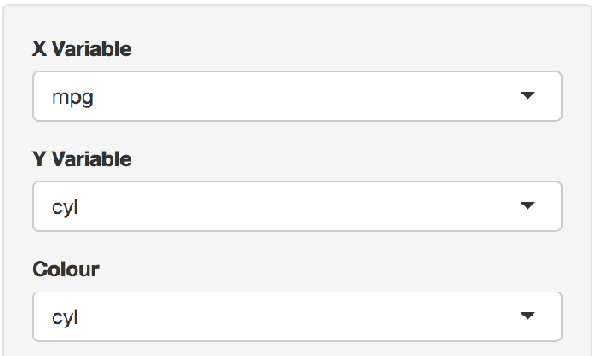

## A new experience awaits you - Explore Car feature relationships!

### Did you ever wonder how the number of cylinders in a car influence the fuel consumption?

### Or the weight of a car, or its horsepower...

### Now you have the chance to become the car 'scientist' you always wanted to be!

### With the brand new, feature rich application you are four clicks away from knowing what only few people know.

--- .class #id 

## Would you like to be able to do this...

```{r,echo=FALSE,comment=NA}
data(mtcars)
library(ggplot2)

p <- ggplot(mtcars, aes(x = mtcars$disp, y = mtcars$mpg))
p + geom_point(aes(colour = factor(mtcars$cyl))) + 
                               xlab("displacement in cu.in.") + 
                               ylab("Miles per Gallon") +
                               scale_colour_discrete(name = "Cylinder")
```

---

### Background:

#### The famous magazine 'Motortrend' collected the data of a variety of cars.

#### For this application we were able to secure the information for 32 automobiles, all the most recent models from the years 1973 to 1974.

#### This is the list of cars included for our application:

```{r,echo=FALSE,  comment=NA}
rownames(mtcars)
```

---

## Go where the action is!

### This is where you can take control




### Follow the link: https://dirkm2577.shinyapps.io/devdataprod_ShinyApp1/
### Enjoy!


