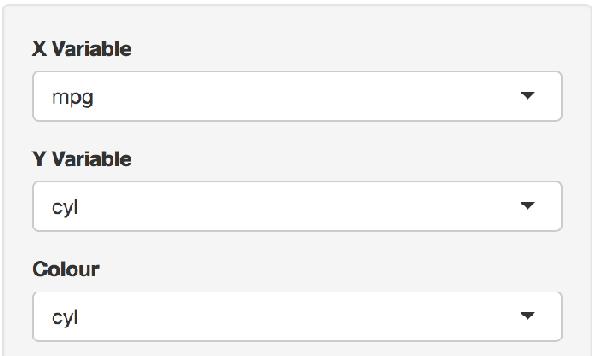

## A new experience awaits you - Explore Car feature relationships!

### Did you ever wonder how the number of cylinders in a car influence the fuel consumption?

### Or the weight of a car, or its horsepower...

### Now you have the chance to become the car 'scientist' you always wanted to be!

### With the brand new, feature rich application you are three clicks away from knowing what only few people know.

--- .class #id 

## Would you like to be able to do this...

 

---

### Background:

#### The famous magazine 'Motortrend' collected the data of a variety of cars.

#### For this application we were able to secure the information for 32 automobiles, all the most recent models from the years 1973 to 1974.

#### This is the list of cars included for our application:


```
 [1] "Mazda RX4"           "Mazda RX4 Wag"       "Datsun 710"         
 [4] "Hornet 4 Drive"      "Hornet Sportabout"   "Valiant"            
 [7] "Duster 360"          "Merc 240D"           "Merc 230"           
[10] "Merc 280"            "Merc 280C"           "Merc 450SE"         
[13] "Merc 450SL"          "Merc 450SLC"         "Cadillac Fleetwood" 
[16] "Lincoln Continental" "Chrysler Imperial"   "Fiat 128"           
[19] "Honda Civic"         "Toyota Corolla"      "Toyota Corona"      
[22] "Dodge Challenger"    "AMC Javelin"         "Camaro Z28"         
[25] "Pontiac Firebird"    "Fiat X1-9"           "Porsche 914-2"      
[28] "Lotus Europa"        "Ford Pantera L"      "Ferrari Dino"       
[31] "Maserati Bora"       "Volvo 142E"         
```

---

## Go where the action is!

### This is where you can take control




### Follow the link: https://dirkm2577.shinyapps.io/devdataprod_ShinyApp1/
### Enjoy!


